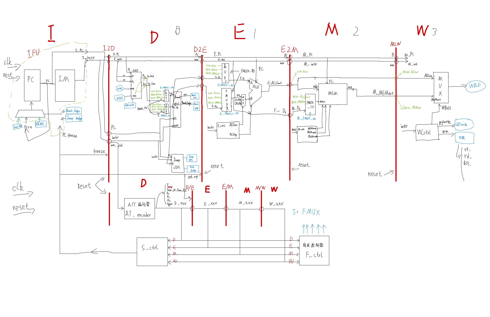

# P5 Pipeline CPU - Verilog Implementation

This project is a five-stage pipelined CPU, developed as part of the *Computer Organization* course design at Beihang University (BUAA). The CPU is designed to execute a subset of the **MIPS instruction set architecture**, and is implemented in Verilog HDL. It focuses on instruction-level parallelism using classic pipeline architecture.


## Project Overview

The P5 CPU consists of five standard pipeline stages:

- F: Instruction Fetch  
- D: Instruction Decode  
- E: Execute  
- M: Memory Access  
- W: Write Back  

Each stage is separated by pipeline registers, and data flows forward at each rising clock edge. The system utilizes a centralized control unit (`control.v`), and distributes decoded control signals by continuously forwarding the instruction (`Instr`) across stages.

## Features

- Centralized control logic (distributed decoding)
- Modular architecture: each pipeline stage is implemented as an independent Verilog module
- Data hazard resolution with forwarding paths (for `D_rs`, `D_rt`, `E_rs`, `E_rt`, `M_rt`)
- Load-use hazard resolution using stalling, via a custom `stall.v` module
- Tuse-Tnew timing model for hazard detection
- Instruction categorization for easier signal generation and decoding

## Hazard Management

### Forwarding

To handle read-after-write (RAW) hazards where the data is computed but not yet written back, forwarding paths are used. A `MUX` and condition checks are added to determine the latest version of data from later pipeline stages.

## Pipeline Diagram

The following diagram shows the complete structure of the pipelined CPU. It includes all five stages (IF, ID, EX, MEM, WB), pipeline registers, hazard detection, and forwarding mechanisms:




## Module Interface Summary

### 1. Instruction Fetch Unit (IFU) - `I_IFU`

| Direction | Name         | Bit Width |
|-----------|--------------|-----------|
| Input     | BranchJudge  | 1         |
| Input     | JumpJudge    | 1         |
| Input     | PCfreeze     | 1         |
| Input     | BranchNPC    | 32        |
| Input     | JumpNPC      | 32        |
| Input     | reset        | 1         |
| Input     | clk          | 1         |
| Output    | PC           | 32        |
| Output    | instr        | 32        |

### 2. Register File (GRF) - `D_GRF`

| Direction | Name      | Bit Width |
|-----------|-----------|-----------|
| Input     | clk       | 1         |
| Input     | reset     | 1         |
| Input     | R1        | 5         |
| Input     | R2        | 5         |
| Input     | WR        | 5         |
| Input     | WD        | 32        |
| Input     | GRFwrite  | 1         |
| Input     | PC        | 32        |
| Output    | D1        | 32        |
| Output    | D2        | 32        |

### 3. D-stage Branch & Jump Control

#### `D_BranchCtrl`

| Direction | Name         | Bit Width |
|-----------|--------------|-----------|
| Input     | D1           | 32        |
| Input     | D2           | 32        |
| Input     | PC           | 32        |
| Input     | instr        | 32        |
| Output    | BranchNPC    | 32        |
| Output    | BranchJudge  | 1         |

#### `D_JumpCtrl`

| Direction | Name        | Bit Width |
|-----------|-------------|-----------|
| Input     | PC          | 32        |
| Input     | instr       | 32        |
| Input     | D1          | 32        |
| Output    | JumpNPC     | 32        |
| Output    | JumpJudge   | 1         |

### 4. Execute Stage Control - `E_ctrl`

| Direction | Name    | Bit Width |
|-----------|---------|-----------|
| Input     | instr   | 32        |
| Output    | ALUsrc  | 1         |
| Output    | ALUop   | 32        |

### 5. Data Memory - `M_MEM`

| Direction | Name       | Bit Width |
|-----------|------------|-----------|
| Input     | reset      | 1         |
| Input     | clk        | 1         |
| Input     | MEMwrite   | 1         |
| Input     | MEMread    | 1         |
| Input     | MEMmode    | 32        |
| Input     | addr       | 32        |
| Input     | data       | 32        |
| Input     | PC         | 32        |
| Output    | out        | 32        |

### 6. Memory Control - `M_ctrl`

| Direction | Name      | Bit Width |
|-----------|-----------|-----------|
| Input     | instr     | 32        |
| Output    | MEMwrite  | 1         |
| Output    | MEMread   | 1         |
| Output    | MEMmode   | 32        |

### 7. Write-back Control - `W_ctrl`

| Direction | Name       | Bit Width |
|-----------|------------|-----------|
| Input     | instr      | 32        |
| Output    | WBslt      | 32        |
| Output    | GRFwrite   | 1         |
| Output    | WR         | 5         |

## Control Signal Definitions

### 1. Write-back Control Signals (`W_ctrl`)

| Signal   | Value | Meaning                      |
|----------|-------|------------------------------|
| GRFwrite | 0     | Do not write to GRF          |
|          | 1     | Enable write to GRF          |
| WR       | 0     | Write to register `rt`       |
|          | 1     | Write to register `rd`       |
|          | 2     | Write to `$31` (e.g. jal)    |
| WBslt    | 0     | Write data from `ALUout`     |
|          | 1     | Write data from `MEMout`     |

### 2. Execute Control Signals (`E_ctrl`)

| Signal   | Value | Meaning                        |
|----------|-------|--------------------------------|
| ALUsrc   | 0     | Use `D2` (register `rt`)       |
|          | 1     | Use zero-extended immediate    |
|          | 2     | Use sign-extended immediate    |
| ALUop    | 0     | Unsigned addition (`a + b`)    |
|          | 1     | Unsigned subtraction (`a - b`) |
|          | 2     | Bitwise OR (`a | b`)           |
|          | 3     | Shift `b` left by 16 (`b << 16`) |
|          | 4     | Use `PC + 8`                   |
|          | 5     | (Reserved or custom)           |

### 3. Memory Control Signals (`M_ctrl`)

| Signal   | Value | Meaning                        |
|----------|-------|--------------------------------|
| MEMwrite | 0     | Do not write to memory         |
|          | 1     | Enable memory write            |
| MEMread  | 0     | Do not read from memory        |
|          | 1     | Enable memory read             |
| MEMmode  | 0     | Word access (32-bit)           |
|          | 1     | Byte access (8-bit)            |
|          | 2     | Half-word access (16-bit)      |

## Sample Test Program

Below is a snippet of the assembly test program used to verify the functionality of the pipelined CPU. The test covers:

- Arithmetic operations (e.g. `addu`, `subu`)
- Memory access (`lw`, `sw`)
- Control transfer (`beq`, `jal`, `jr`)
- Data and control hazard scenarios

### Assembly Instructions

```assembly
ori $4, $4, 4
ori $5, $5, 5
ori $6, $6, 6
sw $5, -4($4)
sw $4, 4($0)
sw $6, 8($0)
lw $5, 0($0)
addu $5, $5, $5

lw $5, 0($0)
ori $7, $7, 1
addu $5, $5, $5

lw $5, 0($0)
ori $7, $7, 2
ori $8, $8, 3
addu $5, $5, $5

lw $5, 0($0)
addu $5, $5, $5
addu $5, $5, $5
addu $5, $5, $5

lw $10, 4($0)
subu $10, $10, $5

# ... (truncated for brevity)
jal bb
ori $25, $25, 25
ori $26, $26, 26
ori $27, $27, 27
j lb_0
nop
bb:
  nop
  nop
  subu $31, $31, $4
  sw $31, 12($0)
  lw $31, 12($0)
  jr $ra
  nop
``` 

### Result Output Log
```assembly
9@00003000: $ 4 <= 00000004
11@00003004: $ 5 <= 00000005
13@00003008: $ 6 <= 00000006
13@0000300c: *00000000 <= 00000005
15@00003010: *00000004 <= 00000004
17@00003014: *00000008 <= 00000006
21@00003018: $ 5 <= 00000005
25@0000301c: $ 5 <= 0000000a
27@00003020: $ 5 <= 00000005
29@00003024: $ 7 <= 00000001
31@00003028: $ 5 <= 0000000a
33@0000302c: $ 5 <= 00000005
35@00003030: $ 7 <= 00000003
37@00003034: $ 8 <= 00000003
39@00003038: $ 5 <= 0000000a
41@0000303c: $ 5 <= 00000005
45@00003040: $ 5 <= 0000000a
47@00003044: $ 5 <= 00000014
49@00003048: $ 5 <= 00000028
51@0000304c: $10 <= 00000004
55@00003050: $10 <= ffffffdc
57@00003054: $10 <= 00000004
59@00003058: $11 <= 0000000b
61@0000305c: $10 <= 00000000
63@00003060: $10 <= 00000004
65@00003064: $11 <= 0000000f
67@00003068: $11 <= 0000000f
69@0000306c: $10 <= 00000000
71@00003070: $10 <= 00000004
73@00003074: $11 <= 00000000
75@00003078: $11 <= 00000000
77@0000307c: $11 <= 00000000
79@00003080: $12 <= 00000005
83@00003084: $12 <= 00000005
85@00003088: $12 <= 00000004
87@0000308c: $13 <= 0000000d
89@00003090: $12 <= 00000004
91@00003094: $12 <= 00000006
93@00003098: $13 <= 0000000d
95@0000309c: $13 <= 0000000f
97@000030a0: $12 <= 00000006
99@000030a4: $12 <= 00000006
103@000030a8: $12 <= 00000006
105@000030ac: $12 <= 00000006
107@000030b0: $14 <= 00000005
109@000030b4: *00000000 <= 00000005
113@000030bc: $14 <= 00000004
115@000030c0: $15 <= 00000005
115@000030c4: *00000004 <= 00000004
119@000030c8: $14 <= 00000006
121@000030cc: $15 <= 00000007
123@000030d0: $15 <= 00000007
123@000030d4: *00000008 <= 00000006
127@000030d8: $16 <= 00000004
131@000030dc: $17 <= 00000005
133@000030e0: $18 <= 00000006
135@000030e4: $19 <= 00000004
137@000030e8: $16 <= 00000004
141@000030ec: $16 <= 00000004
145@000030f0: $16 <= 00000004
149@000030f4: $16 <= 00000004
151@000030f8: $31 <= 00003100
153@000030fc: $25 <= 00000019
159@00003118: $31 <= 000030fc
159@0000311c: *0000000c <= 000030fc
163@00003120: $31 <= 000030fc
173@000030fc: $25 <= 00000019
175@00003100: $26 <= 0000001a
177@00003104: $27 <= 0000001b
183@0000312c: $31 <= 00003134
185@00003130: $25 <= 00000019
191@00003148: $31 <= 00003130
191@0000314c: *0000000c <= 00003130
195@00003150: $31 <= 00003130
205@00003130: $25 <= 00000019
207@00003134: $26 <= 0000001a
209@00003138: $27 <= 0000001b
215@00003160: $31 <= 00003168
217@00003164: $25 <= 00000019
223@0000317c: $31 <= 00003164
223@00003180: *0000000c <= 00003164
227@00003184: $31 <= 00003164
237@00003164: $25 <= 00000019
239@00003168: $26 <= 0000001a
241@0000316c: $27 <= 0000001b
247@00003198: $20 <= 00000005
249@0000319c: $21 <= 00000004
257@000031a4: $23 <= 00000017
259@000031a8: $24 <= 00000018
261@000031ac: $25 <= 00000019
263@000031b0: $20 <= 00000005
265@000031b4: $21 <= 00000004
273@000031c0: $23 <= 00000017
275@000031c4: $24 <= 00000018
277@000031c8: $25 <= 00000019
``` 